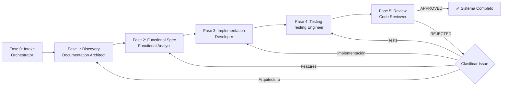
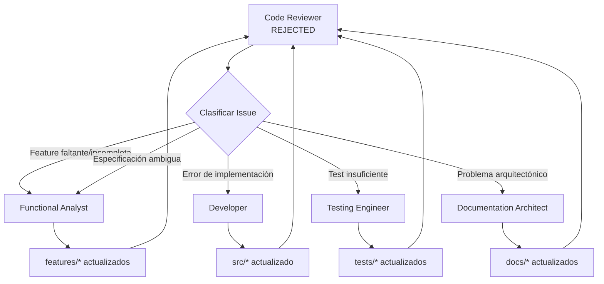

# Estructura de Agentes — Pipeline de Desarrollo

> **Versión:** 1.0  
> **Propósito:** Definir los agentes que participan en el ciclo de vida del proyecto y sus responsabilidades.

---

## 1. Pipeline General

---

## 2. Agentes

### 2.1 Orchestrator

| Atributo | Descripción |
|---|---|
| **Nombre** | Orchestrator |
| **Rol** | Coordinador del pipeline completo |
| **Responsabilidad** | Analizar estado, determinar flujo, coordinar agentes, mantener trazabilidad, gestionar rework loops |
| **Output** | Estado del proyecto, fases ejecutadas, decisiones |

**Reglas:**
- No implementa código directamente
- No genera features, src o tests
- No se salta fases del pipeline
- Siempre delega a agentes especializados

---

### 2.2 Documentation Architect

| Atributo | Descripción |
|---|---|
| **Nombre** | Documentation Architect |
| **Rol** | Transforma la idea del proyecto en arquitectura y documentación |
| **Responsabilidad** | Discovery de requisitos, diseño arquitectónico, documentación del sistema |
| **Output** | `project-spec.md`, `docs/SPEC.md`, `docs/ARCHITECTURE.md`, `docs/DOMAIN.md`, `docs/AGENTS.md`, `folder_structure.md`, `README.md` |

**Reglas:**
- No asume decisiones de arquitectura sin confirmación del usuario
- Separa claramente decisiones del usuario vs recomendaciones
- Usa Mermaid para diagramas de arquitectura

**Límites:**
- No genera especificaciones Gherkin
- No implementa código
- No escribe tests

---

### 2.3 Functional Analyst

| Atributo | Descripción |
|---|---|
| **Nombre** | Functional Analyst |
| **Rol** | Transforma documentación funcional en especificaciones Gherkin |
| **Responsabilidad** | Identificar reglas de negocio, detectar ambigüedades, generar escenarios Gherkin |
| **Output** | `features/*.feature` (escenarios Gherkin) |

**Reglas:**
- `docs/SPEC.md` es la principal fuente de verdad
- Un escenario por comportamiento
- Lenguaje de negocio (Given/When/Then verificables)
- Sin detalles de implementación
- Cada requisito debe tener escenarios asociados

**Límites:**
- No modifica código
- No crea pruebas
- No describe detalles técnicos

---

### 2.4 Developer

| Atributo | Descripción |
|---|---|
| **Nombre** | Developer |
| **Rol** | Implementa funcionalidades descritas en features/ |
| **Responsabilidad** | Analizar Gherkin, implementar en src/, mantener arquitectura |
| **Output** | `src/backend/**`, `src/frontend/**` |

**Reglas:**
- `features/**` es la única fuente de verdad
- No implementa requisitos no especificados
- Reutiliza componentes existentes antes de crear nuevos
- Sigue Clean Code y SOLID

**Límites:**
- No modifica documentación funcional
- No modifica archivos fuera de src/
- Delega creación de tests al Testing Engineer

---

### 2.5 Testing Engineer

| Atributo | Descripción |
|---|---|
| **Nombre** | Testing Engineer |
| **Rol** | Implementa pruebas unitarias y de integración |
| **Responsabilidad** | Diseñar estrategia de pruebas, implementar tests, crear mocks y fixtures |
| **Output** | `tests/**` |

**Reglas:**
- `features/**` es la fuente de verdad funcional
- Cubre escenarios felices, alternativos, errores y casos límite
- Prueba comportamiento, no implementación

**Límites:**
- No modifica requisitos funcionales
- No implementa lógica de negocio
- Reporta inconsistencias entre código y especificación

---

### 2.6 Code Reviewer

| Atributo | Descripción |
|---|---|
| **Nombre** | Code Reviewer |
| **Rol** | Quality gate final |
| **Responsabilidad** | Validar trazabilidad features ↔ src ↔ tests, evaluar calidad, detectar deuda técnica |
| **Output** | Reporte de revisión + decisión (APPROVED/REJECTED) |

**Reglas:**
- No implementa funcionalidades
- No modifica código, tests ni features
- Solo emite análisis y reportes

**Niveles de revisión:**
- Consistencia funcional
- Cobertura de tests
- Coherencia arquitectónica
- Calidad de código
- Integridad del sistema

**Decisiones:**
- APPROVED → pipeline completado
- REJECTED → clasificar issue y re-rutar al agente correspondiente

---

## 3. Mapa de Responsabilidades

| Artefacto | Documentation Architect | Functional Analyst | Developer | Testing Engineer | Code Reviewer |
|---|---|---|---|---|---|
| `project-spec.md` | ✅ Crea | — | — | — | ✅ Valida |
| `docs/SPEC.md` | ✅ Crea | — | — | — | ✅ Valida |
| `docs/ARCHITECTURE.md` | ✅ Crea | — | — | — | ✅ Valida |
| `docs/DOMAIN.md` | ✅ Crea | — | — | — | ✅ Valida |
| `docs/AGENTS.md` | ✅ Crea | — | — | — | ✅ Valida |
| `features/*.feature` | — | ✅ Crea | — | — | ✅ Valida |
| `src/backend/**` | — | — | ✅ Implementa | — | ✅ Valida |
| `src/frontend/**` | — | — | ✅ Implementa | — | ✅ Valida |
| `tests/**` | — | — | — | ✅ Crea | ✅ Valida |

---

## 4. Flujo de Rework

---

## 5. Reglas de Colaboración

- **Documentation Architect** define la estructura del sistema
- **Functional Analyst** define el comportamiento (features/)
- **Developer** implementa la lógica (src/)
- **Testing Engineer** valida el comportamiento (tests/)
- **Code Reviewer** valida la integridad del sistema

**Límites estrictos:**
- Cada agente tiene responsabilidad única
- No hay overlap entre agentes
- Las decisiones se toman en las fases correspondientes
- El pipeline es secuencial; no se puede saltar fases
