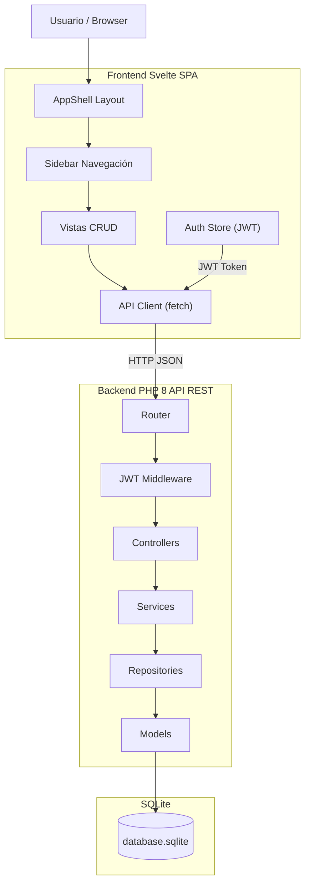
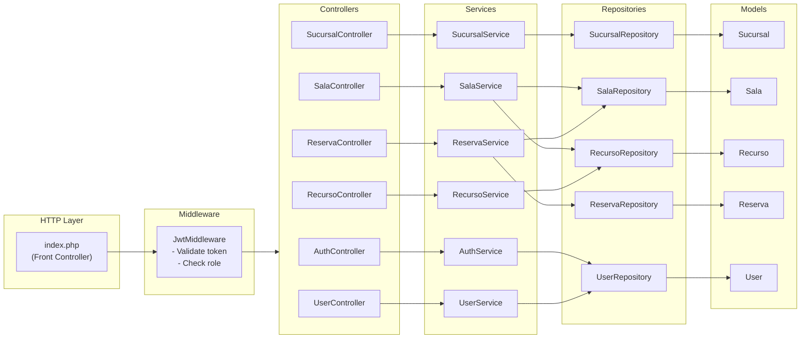
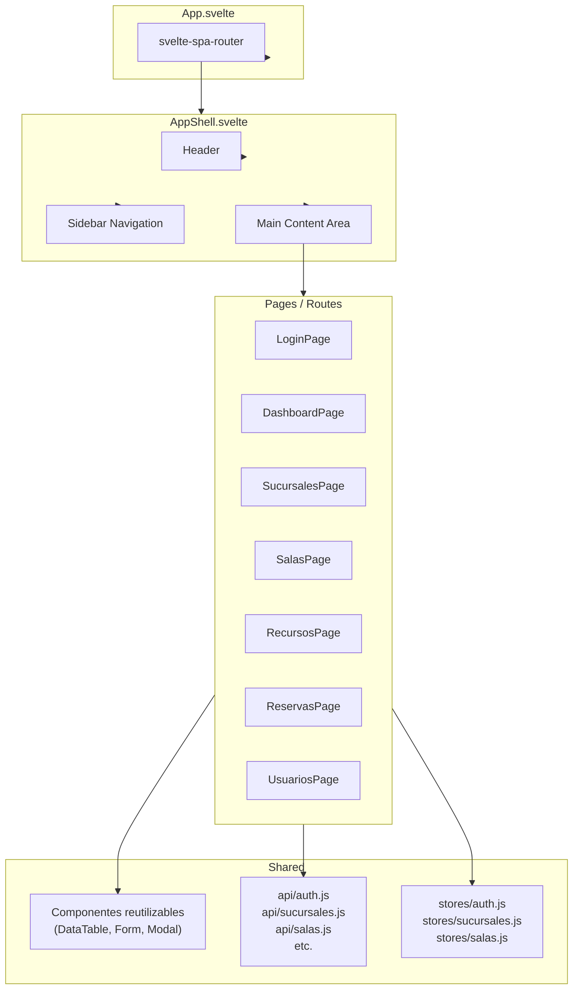
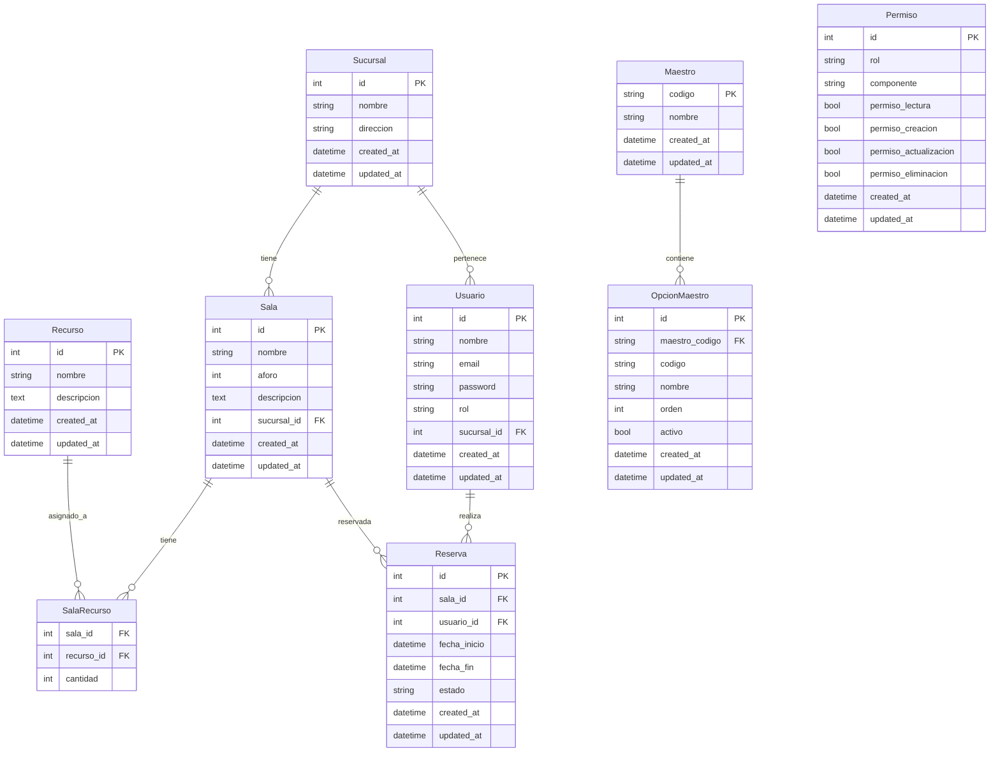
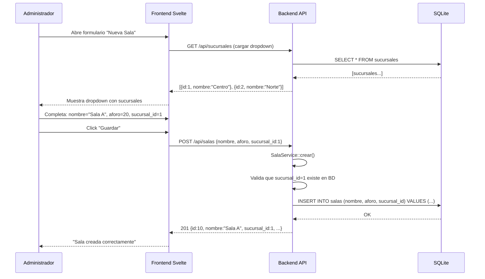
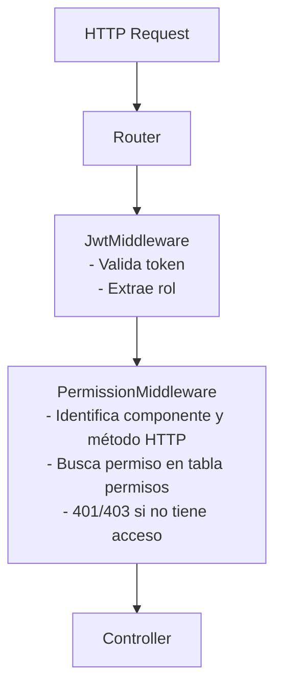

# Arquitectura del Sistema

> **Versión:** 2.0  
> **Stack:** PHP 8 + Svelte + SQLite + JWT

---

## 1. Diagrama de Arquitectura General



---

## 2. Arquitectura Backend — MVC + Repository Pattern



### Flujo de una Petición

```
Request → index.php → Router → JWT Middleware → Controller → Service → Repository → Model → SQLite
                                                                                          ↓
Response ← JSON ← ← ← ← ← ← ← ← ← ← ← ← ← ← ← ← ← ← ← ← ← ← ← ← ← ← ← ← ← ← ← ← ←
```

---

## 3. Arquitectura Frontend — SPA con AppShell



### Navegación (Sidebar)

| Elemento | Ruta | Visible para |
|---|---|---|
| Dashboard | `/` | Admin, Coordinador |
| Sucursales | `/sucursales` | Admin, Coordinador |
| Salas | `/salas` | Admin, Coordinador |
| Recursos | `/recursos` | Admin, Coordinador |
| Usuarios | `/usuarios` | Admin |
| Reservas | `/reservas` | Admin, Coordinador |
| Maestros | `/maestros` | Admin |
| Permisos | `/permisos` | Admin |

---

## 4. Esquema de Base de Datos



---

## 5. API REST — Endpoints

### Autenticación
| Método | Ruta | Acción | Auth |
|---|---|---|---|
| POST | `/api/auth/login` | Iniciar sesión | No |
| POST | `/api/auth/logout` | Cerrar sesión | Sí |
| GET | `/api/auth/me` | Obtener usuario actual | Sí |

### Sucursales
| Método | Ruta | Acción | Rol |
|---|---|---|---|
| GET | `/api/sucursales` | Listar todas | Admin, Coordinador |
| GET | `/api/sucursales/{id}` | Ver detalle | Admin, Coordinador |
| POST | `/api/sucursales` | Crear | Admin |
| PUT | `/api/sucursales/{id}` | Editar | Admin |
| DELETE | `/api/sucursales/{id}` | Eliminar | Admin |

### Salas
| Método | Ruta | Acción | Rol |
|---|---|---|---|
| GET | `/api/salas` | Listar (filtro por sucursal opcional) | Admin, Coordinador |
| GET | `/api/salas/{id}` | Ver detalle con recursos | Admin, Coordinador |
| POST | `/api/salas` | Crear | Admin |
| PUT | `/api/salas/{id}` | Editar | Admin |
| DELETE | `/api/salas/{id}` | Eliminar | Admin |

### Recursos
| Método | Ruta | Acción | Rol |
|---|---|---|---|
| GET | `/api/recursos` | Listar | Admin, Coordinador |
| GET | `/api/recursos/{id}` | Ver detalle | Admin, Coordinador |
| POST | `/api/recursos` | Crear | Admin |
| PUT | `/api/recursos/{id}` | Editar | Admin |
| DELETE | `/api/recursos/{id}` | Eliminar | Admin |

### Asignación Sala-Recurso
| Método | Ruta | Acción | Rol |
|---|---|---|---|
| GET | `/api/salas/{id}/recursos` | Recursos de una sala | Admin, Coordinador |
| POST | `/api/salas/{id}/recursos` | Asignar recurso | Admin |
| DELETE | `/api/salas/{id}/recursos/{recursoId}` | Desasignar recurso | Admin |

### Usuarios
| Método | Ruta | Acción | Rol |
|---|---|---|---|
| GET | `/api/usuarios` | Listar | Admin |
| GET | `/api/usuarios/{id}` | Ver detalle | Admin |
| POST | `/api/usuarios` | Crear | Admin |
| PUT | `/api/usuarios/{id}` | Editar | Admin |
| DELETE | `/api/usuarios/{id}` | Eliminar | Admin |

### Reservas
| Método | Ruta | Acción | Rol |
|---|---|---|---|
| GET | `/api/reservas` | Listar (admin: todas, coord: propias) | Admin, Coordinador |
| GET | `/api/reservas/{id}` | Ver detalle | Admin, Coordinador |
| POST | `/api/reservas` | Crear | Admin, Coordinador |
| PUT | `/api/reservas/{id}/cancelar` | Cancelar | Admin, Coordinador |
| GET | `/api/salas/{id}/disponibilidad` | Ver disponibilidad por fechas | Admin, Coordinador |

### Master Data — Maestros (grupos)
| Método | Ruta | Acción | Rol |
|---|---|---|---|
| GET | `/api/maestros` | Listar grupos de datos maestros | Admin |
| GET | `/api/maestros/{codigo}` | Ver detalle del grupo por código | Admin |
| POST | `/api/maestros` | Crear grupo (ej: {"codigo":"canal_formacion","nombre":"Canal de Formación"}) | Admin |
| PUT | `/api/maestros/{codigo}` | Editar grupo | Admin |
| DELETE | `/api/maestros/{codigo}` | Eliminar grupo | Admin |

### Master Data — Opciones de Maestro (valores)
| Método | Ruta | Acción | Rol |
|---|---|---|---|
| GET | `/api/maestros/{codigo}/opciones` | Listar valores del grupo | Admin |
| POST | `/api/maestros/{codigo}/opciones` | Crear valor (ej: {"codigo":"admin","nombre":"Administrador"}) | Admin |
| PUT | `/api/maestros/opciones/{id}` | Editar valor | Admin |
| DELETE | `/api/maestros/opciones/{id}` | Eliminar valor | Admin |

### Permisos
| Método | Ruta | Acción | Rol |
|---|---|---|---|
| GET | `/api/permisos` | Listar matriz de permisos | Admin |
| GET | `/api/permisos/{rol}` | Ver permisos de un rol específico | Admin |
| PUT | `/api/permisos/{rol}/{componente}` | Actualizar permiso de un rol sobre un componente | Admin |

---

## 6. Asignación Sala ↔ Sucursal — Flujo Completo

Este es el mecanismo por el cual una sala se vincula a una sucursal en las tres capas del sistema.

### 6.1 Nivel Base de Datos

```
Sala
├── id            (INT, PK)
├── nombre        (VARCHAR)
├── aforo         (INT)
├── descripcion   (TEXT, nullable)
├── sucursal_id   (INT, FK → Sucursal.id)  ← FK obligatoria
├── created_at    (DATETIME)
└── updated_at    (DATETIME)
```

- `sucursal_id` es **obligatorio** (NOT NULL) — una sala siempre pertenece a una sucursal.
- La FK garantiza integridad referencial: no se puede asignar una sala a una sucursal que no existe.
- No se puede eliminar una sucursal si tiene salas asociadas (o se maneja con ON DELETE RESTRICT / CASCADE).

### 6.2 Nivel API (Backend)

#### Crear Sala (POST /api/salas)
```
Request Body:
{
    "nombre": "Sala de Formación A",
    "aforo": 20,
    "descripcion": "Planta baja, ala norte",
    "sucursal_id": 1          ← Campo obligatorio
}

Validaciones en SalaService::crear():
  1. sucursal_id es requerido
  2. La sucursal debe existir (SucursalRepository::findById())
  3. nombre no vacío
  4. aforo > 0
  5. Se persiste Sala con sucursal_id → SalaRepository::save()

Response 201:
{
    "id": 1,
    "nombre": "Sala de Formación A",
    "aforo": 20,
    "descripcion": "Planta baja, ala norte",
    "sucursal_id": 1,
    "sucursal_nombre": "Sucursal Centro"
}
```

#### Editar Sala (PUT /api/salas/{id})
```
Request Body:
{
    "nombre": "Sala de Formación A (Renovada)",
    "aforo": 25,
    "sucursal_id": 2   ← Se puede re-asignar a otra sucursal
}
```

#### Listar Salas (GET /api/salas)
```
Query params opcionales:
  ?sucursal_id=1     ← Filtra salas por sucursal

Response 200:
[
    {
        "id": 1,
        "nombre": "Sala A",
        "aforo": 20,
        "sucursal_id": 1,
        "sucursal_nombre": "Sucursal Centro",
        "recursos": ["Proyector", "Pizarra"]
    }
]
```

### 6.3 Nivel Frontend (Svelte)

#### Flujo en SalasPage.svelte (Crear/Editar Sala)

```
Formulario de Sala:
├── nombre         → <input text>
├── aforo          → <input number>
├── descripcion    → <textarea>
├── sucursal_id    → <select>  ← Dropdown con lista de sucursales
│                    Cargado desde GET /api/sucursales
│                    El coordinador ve solo sucursales disponibles
│                    El admin ve todas las sucursales
└── [Guardar]      → POST/PUT /api/salas
```

### 6.4 Diagrama de Secuencia — Asignación Sala a Sucursal



---

## 7. Sistema de Migraciones de Base de Datos

El backend incluye un sistema de migraciones automatizado que se ejecuta en cada arranque de la aplicación (`public/index.php`).

### 7.1 Comportamiento

```
Al iniciar la aplicación:
  ┌─ ¿Existe database.sqlite?
  │   ├── NO  → Crear archivo vacío
  │   └── SÍ  → Continuar
  │
  └─ ¿Existe tabla migrations?
      ├── NO  → Crear tabla migrations
      └── SÍ  → Continuar
      
      └─ Escanear database/migrations/*.sql
          └─ Por cada archivo NO ejecutado (según tabla migrations):
              ├── Ejecutar SQL
              ├── ¿Éxito? → INSERT en tabla migrations (filename, md5, executed_at)
              └── ¿Error? → INSERT en tabla migrations con error_log + LOG de error
```

### 7.2 Tabla de Control `migrations`

```sql
CREATE TABLE IF NOT EXISTS migrations (
    id          INTEGER PRIMARY KEY AUTOINCREMENT,
    filename    TEXT    NOT NULL UNIQUE,
    file_hash   TEXT    NOT NULL,           -- MD5 del archivo para detectar cambios
    executed_at TEXT    NOT NULL DEFAULT (datetime('now')),
    status      TEXT    NOT NULL DEFAULT 'ok',  -- 'ok' | 'error'
    error_log   TEXT    NULL                    -- Mensaje de error si status='error'
);
```

### 7.3 Clase MigrationManager

**Ubicación:** `src/backend/Database/MigrationManager.php`

| Método | Descripción |
|---|---|
| `__construct(Database $db, string $migrationsPath)` | Recibe conexión y ruta a migraciones |
| `run()` | Ejecuta el pipeline completo de migraciones |
| `getPendingMigrations(): array` | Lista archivos SQL pendientes |
| `executeMigration(string $filename): bool` | Ejecuta un archivo SQL y registra resultado |
| `getExecutedMigrations(): array` | Migraciones ya ejecutadas |
| `hasErrors(): bool` | Indica si hubo errores |
| `getErrors(): array` | Devuelve los errores encontrados |

### 7.4 Flujo de Ejecución en `index.php`

```php
// public/index.php
require_once __DIR__ . '/../Config/Database.php';
require_once __DIR__ . '/../Database/MigrationManager.php';

$db = new Database();
$migrator = new MigrationManager($db, __DIR__ . '/../../database/migrations/');
$result = $migrator->run();

if ($migrator->hasErrors()) {
    // Los errores ya fueron registrados en la tabla migrations
    // y en el sistema de logs
    http_response_code(500);
    echo json_encode(['error' => 'Error en migraciones', 'details' => $migrator->getErrors()]);
    exit;
}

// Continuar con el router de la aplicación...
```

### 7.5 Formato de Archivos de Migración

Los archivos SQL deben estar en `database/migrations/` con el formato:

```
001_create_sucursales.sql
002_create_salas.sql
003_create_recursos.sql
004_create_sala_recursos.sql
005_create_usuarios.sql
006_create_reservas.sql
007_create_maestros.sql
008_create_opciones_maestro.sql
009_create_permisos.sql
010_seed_master_data.sql           # Datos iniciales (roles, estados, permisos base)
```

Cada archivo puede contener múltiples sentencias SQL separadas por `;`.

---

## 8. Sistema de Logging

El backend incluye un sistema de logging ligero para capturar errores y eventos de la aplicación.

### 8.1 Clase Logger

**Ubicación:** `src/backend/Log/Logger.php`

| Método | Descripción |
|---|---|
| `info(string $message, array $context = [])` | Registro informativo |
| `warning(string $message, array $context = [])` | Advertencia |
| `error(string $message, array $context = [])` | Error |
| `debug(string $message, array $context = [])` | Debug (solo si APP_DEBUG=true) |

### 8.2 Formato de Salida

Cada línea de log sigue el formato:

```
[2026-06-09 14:30:00] [ERROR] [AuthService::login] Credenciales inválidas - {"email":"user@test.com"}
[2026-06-09 14:31:00] [INFO] [ReservaService::crear] Reserva #123 creada exitosamente
[2026-06-09 14:32:00] [WARNING] [MigrationManager::execute] Falló migración 004 - {"filename":"004_create_sala_recursos.sql"}
```

**Campos:**
- Timestamp ISO 8601
- Nivel (ERROR, WARNING, INFO, DEBUG)
- Clase y método origen
- Mensaje descriptivo
- Contexto opcional en JSON

### 8.3 Archivos de Log

| Archivo | Propósito |
|---|---|
| `logs/app.log` | Log principal de la aplicación |
| `logs/error.log` | Solo errores (duplicado de app.log para errores) |

### 8.4 Configuración (`Config/app.php`)

```php
'log' => [
    'path'      => __DIR__ . '/../../../logs/',
    'level'     => 'debug',       // debug | info | warning | error
    'max_files' => 7,              // Rotación diaria, conserva 7 días
    'app_name'  => 'salas-formacion',
],
```

### 8.5 Uso en la Aplicación

```php
// En Services, Controllers, Middleware, MigrationManager:

$logger = new Logger();
$logger->info('Reserva creada', ['reserva_id' => 123, 'sala' => 'Sala A']);
$logger->error('Error al crear reserva', ['error' => $e->getMessage()]);
```

---

## 9. Sistema de Permisos (Basado en Componentes)

### 9.1 Modelo de Datos

La tabla `permisos` almacena una matriz de permisos por **rol** y **componente** del sistema:

| Columna | Descripción | Ejemplo |
|---|---|---|
| `rol` | Nombre del rol (almacenado como string, referenciado desde OpcionMaestroValor) | `admin`, `coordinador` |
| `componente` | Nombre del componente del sistema | `sucursales`, `salas`, `reservas`, `recursos`, `usuarios`, `maestros`, `permisos` |
| `permiso_lectura` | Permiso de lectura (GET) | `1` o `0` |
| `permiso_creacion` | Permiso de creación (POST) | `1` o `0` |
| `permiso_actualizacion` | Permiso de actualización (PUT) | `1` o `0` |
| `permiso_eliminacion` | Permiso de eliminación (DELETE) | `1` o `0` |

### 9.2 Matriz de Permisos por Defecto (Seed)

| Rol | Componente | GET | POST | PUT | DELETE |
|---|---|---|---|---|---|
| **admin** | sucursales | ✅ | ✅ | ✅ | ✅ |
| **admin** | salas | ✅ | ✅ | ✅ | ✅ |
| **admin** | recursos | ✅ | ✅ | ✅ | ✅ |
| **admin** | reservas | ✅ | ✅ | ✅ | ✅ |
| **admin** | usuarios | ✅ | ✅ | ✅ | ✅ |
| **admin** | maestros | ✅ | ✅ | ✅ | ✅ |
| **admin** | permisos | ✅ | ❌ | ✅ | ❌ |
| **coordinador** | sucursales | ✅ | ❌ | ❌ | ❌ |
| **coordinador** | salas | ✅ | ❌ | ❌ | ❌ |
| **coordinador** | recursos | ✅ | ❌ | ❌ | ❌ |
| **coordinador** | reservas | ✅ | ✅ | ❌ | ✅ (cancelar) |
| **coordinador** | usuarios | ❌ | ❌ | ❌ | ❌ |
| **coordinador** | maestros | ❌ | ❌ | ❌ | ❌ |
| **coordinador** | permisos | ❌ | ❌ | ❌ | ❌ |

### 9.3 Integración con el Middleware

El `JwtMiddleware` se complementa con un nuevo `PermissionMiddleware` que verifica que el rol autenticado tenga el permiso adecuado para la ruta solicitada.



**Flujo interno de PermissionMiddleware:**

```php
// Middleware/PermissionMiddleware.php
class PermissionMiddleware {
    public function handle(Request $request, callable $next): Response {
        $rol = $request->getAttribute('jwt_payload')['rol'];
        $componente = $this->resolveComponente($request->getUri());  // ej: 'salas'
        $metodo = $request->getMethod();                             // ej: 'POST'

        $permiso = $this->permisoRepository->findByRolYComponente($rol, $componente);

        if (!$permiso || !$this->tienePermiso($permiso, $metodo)) {
            $this->logger->warning("Acceso denegado", [
                'rol' => $rol, 'componente' => $componente, 'metodo' => $metodo
            ]);
            return new JsonResponse(['error' => 'No tienes permiso para esta acción'], 403);
        }

        return $next($request);
    }

    private function tienePermiso(array $permiso, string $metodo): bool {
        return match ($metodo) {
            'GET'     => (bool) $permiso['permiso_lectura'],
            'POST'    => (bool) $permiso['permiso_creacion'],
            'PUT'     => (bool) $permiso['permiso_actualizacion'],
            'DELETE'  => (bool) $permiso['permiso_eliminacion'],
            default   => false,
        };
    }

    private function resolveComponente(string $uri): string {
        // /api/salas/123/recursos → 'salas'
        // /api/reservas → 'reservas'
        $parts = explode('/', parse_url($uri, PHP_URL_PATH));
        return $parts[2] ?? '';  // 'api', '{componente}', ...
    }
}
```

### 9.4 Mapeo Componente ↔ Método HTTP

| Operación CRUD | Método HTTP | Columna en DB |
|---|---|---|
| Listar / Ver | `GET` | `permiso_lectura` |
| Crear | `POST` | `permiso_creacion` |
| Editar | `PUT` | `permiso_actualizacion` |
| Eliminar / Cancelar | `DELETE` | `permiso_eliminacion` |

### 9.5 Frontend — Sidebar Reactivo a Permisos

El sidebar del AppShell consulta `GET /api/permisos/{rol}` al cargar y muestra/oculta opciones según los permisos del usuario autenticado.

```javascript
// stores/auth.js (ejemplo conceptual)
const permisos = await api.get(`/api/permisos/${user.rol}`);
// permisos = [{componente: 'reservas', permiso_lectura: 1, permiso_creacion: 1, ...}, ...]

// Sidebar.svelte
{#each permisos as permiso}
    {#if permiso.permiso_lectura}
        <NavItem href="/{permiso.componente}" label={capitalize(permiso.componente)} />
    {/if}
{/each}
```

### 9.6 Beneficios de este Enfoque

- **Configurable desde UI:** El admin puede modificar permisos sin tocar código.
- **Granular:** Control fino sobre cada operación CRUD por componente y rol.
- **Extensible:** Agregar un nuevo componente solo requiere insertar filas en `permisos`.
- **Consistente:** El mismo motor de permisos gobierna backend (middleware) y frontend (sidebar).
- **Auditable:** Cada denegación queda registrada en el Logger.

---

## 10. Estructura de Archivos — Backend

```
src/backend/
├── public/
│   └── index.php                 # Front Controller + boot (migraciones, CORS, routing)
├── Config/
│   ├── Database.php              # Conexión SQLite (PDO)
│   └── app.php                   # Configuración general (JWT secret, CORS, log, debug)
├── Routes/
│   └── api.php                   # Definición de rutas
├── Middleware/
│   ├── JwtMiddleware.php             # Validación y parseo de JWT
│   ├── PermissionMiddleware.php      # Verifica permisos CRUD por rol+componente
│   └── CorsMiddleware.php            # Cabeceras CORS
├── Controllers/
│   ├── AuthController.php
│   ├── SucursalController.php
│   ├── SalaController.php
│   ├── RecursoController.php
│   ├── ReservaController.php
│   ├── UsuarioController.php
│   ├── MaestroController.php         # CRUD grupos de datos maestros
│   └── PermisoController.php         # Gestión de matriz de permisos
├── Services/
│   ├── AuthService.php
│   ├── SucursalService.php
│   ├── SalaService.php
│   ├── RecursoService.php
│   ├── ReservaService.php
│   ├── UsuarioService.php
│   ├── MaestroService.php            # CRUD maestros + opciones
│   └── PermisoService.php            # Consulta y actualización de permisos
├── Models/
│   ├── Sucursal.php
│   ├── Sala.php
│   ├── Recurso.php
│   ├── SalaRecurso.php
│   ├── Reserva.php
│   ├── Usuario.php
│   ├── Maestro.php
│   ├── OpcionMaestro.php
│   └── Permiso.php
├── Repositories/
│   ├── SucursalRepository.php
│   ├── SalaRepository.php
│   ├── RecursoRepository.php
│   ├── ReservaRepository.php
│   ├── UsuarioRepository.php
│   ├── MaestroRepository.php
│   └── PermisoRepository.php
├── Database/
│   └── MigrationManager.php          # Gestor de migraciones SQL
└── Log/
    └── Logger.php                    # Sistema de logging
```
---

---

## 10. Entornos de Base de Datos — Desarrollo vs Testing

El sistema utiliza **bases de datos SQLite separadas** para cada entorno, evitando que los tests contaminen los datos de desarrollo.

### 10.1 Entornos Definidos

| Entorno | Archivo BD | Propósito |
|---|---|---|
| **Desarrollo** | `database/database.sqlite` | Datos reales de la aplicación en desarrollo |
| **Testing** | `tests/backend/test_db.sqlite` | Base de datos temporal para ejecución de tests |

### 10.2 Configuración vía `Config/app.php`

```php
// Config/app.php
'database' => [
    'dev'  => __DIR__ . '/../../database/database.sqlite',
    'test' => __DIR__ . '/../../tests/backend/test_db.sqlite',
],
```

### 10.3 Clase Database con Selección de Entorno

La clase `Database` acepta un parámetro para elegir qué archivo usar.

```php
// Config/Database.php
class Database {
    private ?PDO $connection = null;

    public function __construct(?string $dbPath = null) {
        if ($dbPath === null) {
            $config = require __DIR__ . '/app.php';
            $dbPath = $config['database']['dev'];  // Por defecto: desarrollo
        }
        $this->connect($dbPath);
    }

    public static function forTest(): self {
        $config = require __DIR__ . '/app.php';
        return new self($config['database']['test']);
    }
}
```

### 10.4 Uso en Desarrollo (`public/index.php`)

```php
$db = new Database();              // Usa database/database.sqlite
$migrator = new MigrationManager($db, __DIR__ . '/../../database/migrations/');
$migrator->run();
```

### 10.5 Uso en Testing

```php
// tests/backend/SomeTest.php
$db = Database::forTest();         // Usa tests/backend/test_db.sqlite
$migrator = new MigrationManager($db, __DIR__ . '/../../../database/migrations/');
$migrator->run();

// Ejecutar tests contra BD limpia y aislada
```

### 10.6 Ventajas de este enfoque

- **Aislamiento total:** Los tests nunca modifican datos de desarrollo.
- **Repetibilidad:** Cada ejecución de tests puede comenzar con una BD vacía o con seeds controlados.
- **Migraciones compartidas:** Ambos entornos ejecutan los mismos archivos `database/migrations/*.sql`, garantizando que el esquema sea idéntico.
- **Sin configuración额外:** El `phpunit.xml` o script de tests puede llamar a `Database::forTest()` sin variables de entorno.

---

## 11. Estructura de Archivos — Frontend

```
src/frontend/
├── package.json
├── vite.config.js
├── svelte.config.js
├── static/
│   └── favicon.ico
└── src/
    ├── main.js                   # Punto de entrada
    ├── App.svelte                # Router principal
    ├── lib/
    │   ├── api/
    │   │   ├── auth.js
    │   │   ├── sucursales.js
    │   │   ├── salas.js
    │   │   ├── recursos.js
    │   │   ├── reservas.js
    │   │   └── usuarios.js
    │   ├── components/
    │   │   ├── DataTable.svelte
    │   │   ├── FormField.svelte
    │   │   ├── ConfirmModal.svelte
    │   │   ├── Pagination.svelte
    │   │   └── LoadingSpinner.svelte
    │   └── layouts/
    │       ├── AppShell.svelte
    │       ├── Sidebar.svelte
    │       └── Header.svelte
├── routes/
│   ├── LoginPage.svelte
│   ├── DashboardPage.svelte
│   ├── SucursalesPage.svelte
│   ├── SalasPage.svelte
│   ├── RecursosPage.svelte
│   ├── ReservasPage.svelte
│   ├── UsuariosPage.svelte
│   ├── MaestrosPage.svelte          # CRUD maestros + opciones
│   └── PermisosPage.svelte          # Matriz de permisos por rol
└── stores/
    ├── auth.js
    ├── permisos.js                  # Carga permisos del usuario autenticado
    └── ui.js
```
