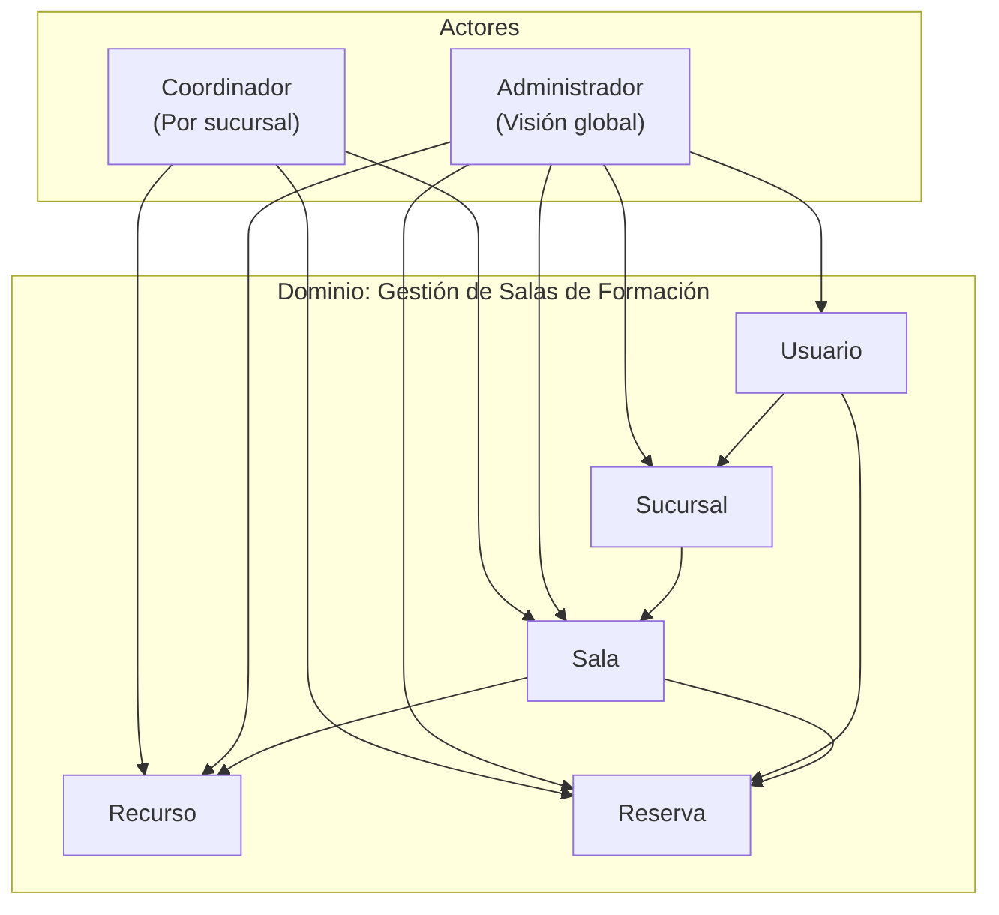
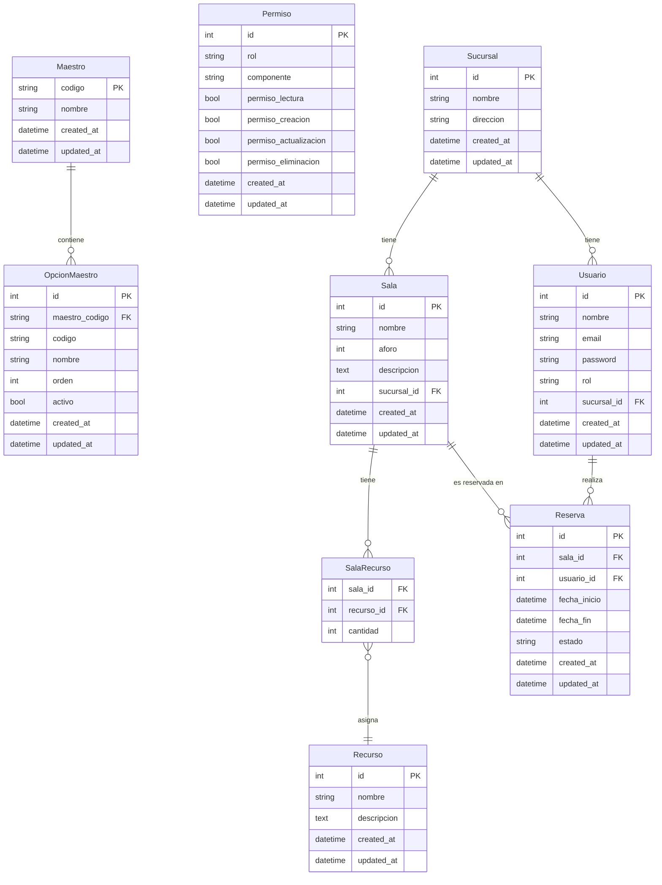

# Modelo de Dominio

> **Versión:** 1.2  
> **Dominio:** Gestión de salas de formación en call center multi-sucursal

---

## 1. Mapa de Contexto

---

## 2. Entidades del Dominio

### 2.1 Maestro

Representa un grupo de datos maestros (elementos estáticos pero configurables) del sistema.

| Atributo | Tipo | Descripción |
|---|---|---|
| `codigo` | `string` | Identificador único (PK) — ej: `user_role`, `reserva_estado`, `tipo_recurso` |
| `nombre` | `string` | Nombre legible (ej: "Roles de Usuario", "Estados de Reserva") |
| `created_at` | `datetime` | Fecha de creación |
| `updated_at` | `datetime` | Fecha de última modificación |

**Comportamiento:**
- `codigo` es la clave primaria natural y se usa como FK desde `OpcionMaestro`
- Cada grupo contiene múltiples valores (OpcionMaestro)
- Un grupo no se puede eliminar si tiene valores asociados
- Los códigos de grupo son únicos en el sistema por definición (PK)

---

### 2.2 OpcionMaestro

Representa un valor concreto dentro de un grupo de datos maestros.

| Atributo | Tipo | Descripción |
|---|---|---|
| `id` | `int` | Identificador único (PK) |
| `maestro_codigo` | `string` | FK → Maestro.codigo |
| `codigo` | `string` | Código único dentro del grupo (ej: `admin`, `coordinador`, `confirmada`) |
| `nombre` | `string` | Nombre legible (ej: "Administrador", "Coordinador", "Confirmada") |
| `orden` | `int` | Posición para ordenar en dropdowns |
| `activo` | `bool` | Si está activo (para desactivar valores sin eliminar) |
| `created_at` | `datetime` | Fecha de creación |
| `updated_at` | `datetime` | Fecha de última modificación |

**Comportamiento:**
- El par (maestro_codigo, codigo) es único
- Un valor desactivado (activo=0) no se muestra en dropdowns pero sigue siendo válido en registros existentes
- Los valores pueden reordenarse mediante el campo `orden`

**Ejemplos de datos maestros:**
| Grupo (codigo) | Valores |
|---|---|
| `user_role` | `admin` → Administrador, `coordinador` → Coordinador |
| `reserva_estado` | `confirmada` → Confirmada, `cancelada` → Cancelada |
| `tipo_recurso` | `proyector`, `pizarra`, `tv`, `equipo_audio` |

---

### 2.3 Permiso

Representa un permiso CRUD asociado a un rol y un componente del sistema.

| Atributo | Tipo | Descripción |
|---|---|---|
| `id` | `int` | Identificador único (PK) |
| `rol` | `string` | Nombre del rol (referencia a OpcionMaestro.codigo del grupo `user_role`) |
| `componente` | `string` | Componente del sistema (ej: `sucursales`, `salas`, `reservas`, `recursos`, `usuarios`, `opciones_maestro`, `permisos`) |
| `permiso_lectura` | `bool` | Permiso GET (lectura/listado) |
| `permiso_creacion` | `bool` | Permiso POST (creación) |
| `permiso_actualizacion` | `bool` | Permiso PUT (actualización) |
| `permiso_eliminacion` | `bool` | Permiso DELETE (eliminación) |
| `created_at` | `datetime` | Fecha de creación |
| `updated_at` | `datetime` | Fecha de última modificación |

**Comportamiento:**
- La combinación (rol, componente) es única
- Si un permiso no existe para un (rol, componente), se deniega el acceso por defecto
- Los roles se referencian desde OpcionMaestro del grupo `user_role` para mantener consistencia

---

### 2.4 Sucursal

Representa una sucursal física del call center.

| Atributo | Tipo | Descripción |
|---|---|---|
| `id` | `int` | Identificador único (PK) |
| `nombre` | `string` | Nombre de la sucursal |
| `direccion` | `string` | Dirección física |
| `created_at` | `datetime` | Fecha de creación |
| `updated_at` | `datetime` | Fecha de última modificación |

**Comportamiento:**
- Una sucursal puede tener múltiples salas
- Un usuario coordinador debe estar asociado a una sucursal
- Los administradores pueden no estar asociados a ninguna sucursal específica

---

### 2.5 Sala

Representa una sala de formación dentro de una sucursal.

| Atributo | Tipo | Descripción |
|---|---|---|
| `id` | `int` | Identificador único (PK) |
| `nombre` | `string` | Nombre de la sala (ej: "Sala A", "Training Room 1") |
| `aforo` | `int` | Capacidad máxima de personas |
| `descripcion` | `text` | Descripción opcional |
| `sucursal_id` | `int` | FK → Sucursal |
| `created_at` | `datetime` | Fecha de creación |
| `updated_at` | `datetime` | Fecha de última modificación |

**Comportamiento:**
- Pertenece exactamente a una sucursal
- Puede tener múltiples recursos asignados
- Su disponibilidad depende de las reservas existentes

---

### 2.6 Recurso

Representa un recurso físico disponible en las salas.

| Atributo | Tipo | Descripción |
|---|---|---|
| `id` | `int` | Identificador único (PK) |
| `nombre` | `string` | Nombre (ej: "Proyector", "Pizarra", "TV 55\"") |
| `descripcion` | `text` | Descripción opcional |
| `created_at` | `datetime` | Fecha de creación |
| `updated_at` | `datetime` | Fecha de última modificación |

**Comportamiento:**
- Puede estar asignado a múltiples salas mediante la relación SalaRecurso
- Es un catálogo global (no por sucursal)

---

### 2.7 SalaRecurso (Relación)

Representa la asignación de un recurso a una sala con una cantidad específica.

| Atributo | Tipo | Descripción |
|---|---|---|
| `sala_id` | `int` | FK → Sala |
| `recurso_id` | `int` | FK → Recurso |
| `cantidad` | `int` | Cantidad del recurso en esa sala (default: 1) |

**Comportamiento:**
- Tabla pivote many-to-many entre Sala y Recurso
- Una sala puede tener 0 o más recursos
- Un recurso puede estar en 0 o más salas

---

### 2.8 Usuario

Representa un usuario del sistema.

| Atributo | Tipo | Descripción |
|---|---|---|
| `id` | `int` | Identificador único (PK) |
| `nombre` | `string` | Nombre completo |
| `email` | `string` | Email (único, usado para login) |
| `password` | `string` | Contraseña hasheada (bcrypt) |
| `rol` | `enum('admin','coordinador')` | Rol del usuario |
| `sucursal_id` | `int` | FK → Sucursal (nullable, solo coordinadores) |
| `created_at` | `datetime` | Fecha de creación |
| `updated_at` | `datetime` | Fecha de última modificación |

**Comportamiento:**
- Admin: acceso completo, sin sucursal asociada
- Coordinador: asociado a una sucursal, solo gestiona sus reservas
- Autenticación mediante JWT

---

### 2.9 Reserva

Representa la reserva de una sala por un usuario en un rango de tiempo.

| Atributo | Tipo | Descripción |
|---|---|---|
| `id` | `int` | Identificador único (PK) |
| `sala_id` | `int` | FK → Sala |
| `usuario_id` | `int` | FK → Usuario |
| `fecha_inicio` | `datetime` | Fecha y hora de inicio |
| `fecha_fin` | `datetime` | Fecha y hora de fin |
| `estado` | `enum('confirmada','cancelada')` | Estado de la reserva |
| `created_at` | `datetime` | Fecha de creación |
| `updated_at` | `datetime` | Fecha de última modificación |

**Comportamiento:**
- Validación de disponibilidad: no deben existir reservas confirmadas con rango de fecha+hora solapado para la misma sala (una sala puede usarse varias veces al día, pero nunca en horarios que se superpongan)
- La validación compara `fecha_inicio` y `fecha_fin` como datetime completo: `reserva_nueva.fecha_inicio < reserva_existente.fecha_fin AND reserva_nueva.fecha_fin > reserva_existente.fecha_inicio`
- Solo se pueden cancelar reservas futuras
- Un coordinador solo puede ver/gestionar sus propias reservas
- Un admin puede ver/gestionar cualquier reserva

---

## 3. Diagrama de Entidad-Relación

---

## 4. Reglas de Negocio (Dominio)

| ID | Regla | Entidades Afectadas |
|---|---|---|
| RN-01 | Una sala pertenece a una única sucursal | Sala, Sucursal |
| RN-02 | Un recurso puede estar en múltiples salas | Recurso, Sala, SalaRecurso |
| RN-03 | Una sala puede tener 0 o más recursos | Sala, SalaRecurso |
| RN-04 | El aforo debe ser un entero positivo | Sala |
| RN-05 | No puede haber reservas con fecha+hora solapadas para la misma sala (valida datetime completo) | Reserva, Sala |
| RN-06 | El coordinador solo gestiona sus propias reservas | Usuario, Reserva |
| RN-07 | Un coordinador debe pertenecer a una sucursal | Usuario |
| RN-08 | Solo se cancelan reservas futuras | Reserva |
| RN-09 | Admin no está asociado a ninguna sucursal específica | Usuario |
| RN-10 | El email de usuario debe ser único | Usuario |
| RN-11 | El código de Maestro es la PK y debe ser único | Maestro |
| RN-12 | El par (maestro_codigo, codigo) en OpcionMaestro debe ser único | OpcionMaestro |
| RN-13 | Un valor desactivado (activo=0) sigue siendo válido en registros existentes | OpcionMaestro |
| RN-14 | La combinación (rol, componente) en Permiso debe ser única | Permiso |
| RN-15 | Si un permiso no existe para un (rol, componente), se deniega el acceso | Permiso |
| RN-16 | El admin siempre debe tener permiso_lectura=1 en todos los componentes | Permiso |
